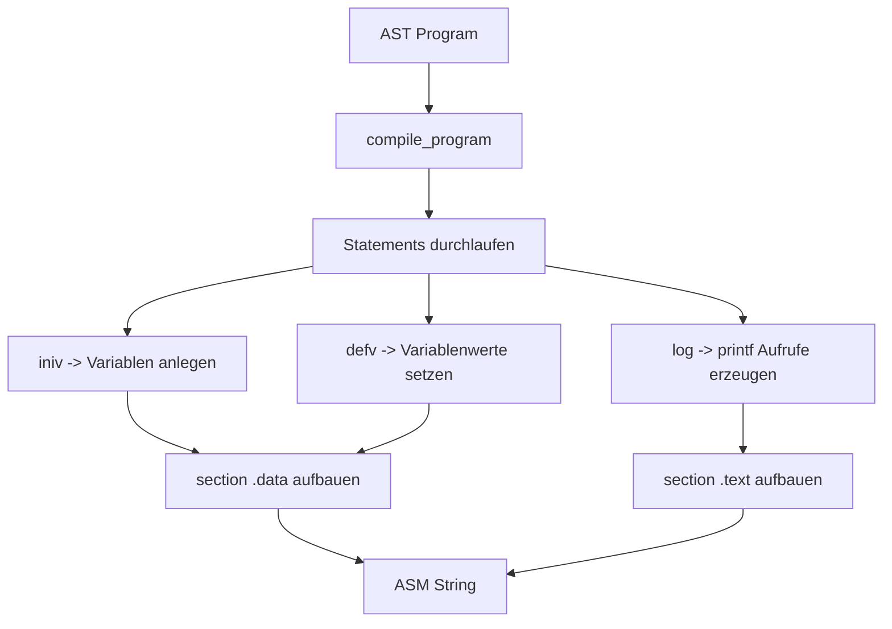
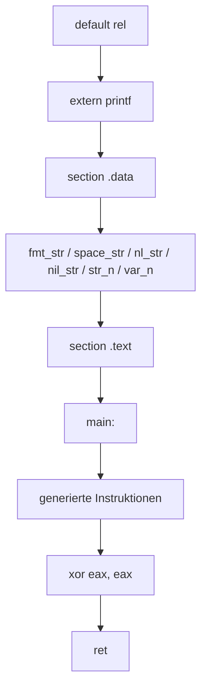

# Codegen-Erklaerung (NASM Backend)

Diese Datei erklaert den aktuellen Codegenerator aus [codegen_asm.py](../codegen_asm.py).

Ziel des Codegen:

- AST in NASM x64 Assembly umwandeln
- Built-ins `iniv`, `defv`, `log` unterstuetzen
- Ausgabe ueber `printf` realisieren

## 1) Input und Output

Input:

- AST-Root vom Typ `Program`

Output:

- ein String mit vollstaendigem NASM-Quelltext
- wird spaeter nach `output/output.asm` geschrieben

## 2) High-Level Pipeline



## 3) Wichtige interne Datenstrukturen

In `compile_program` werden folgende Strukturen genutzt:

- `data_lines`
  - sammelt alle Daten-Labels fuer `section .data`

- `text_lines`
  - sammelt alle Instruktionen fuer `section .text`

- `string_labels: dict[str, str]`
  - dedupliziert Strings
  - gleicher String bekommt immer gleiches Label

- `variables: dict[str, str]`
  - mappt Variablennamen auf Speicherlabel (`var_name`)

- `string_counter`
  - erzeugt eindeutige Labels `str_0`, `str_1`, ...

## 4) Standard-Labels im Data-Segment

Zu Beginn werden Basis-Labels angelegt:

- `fmt_str db "%s", 0`
- `space_str db " ", 0`
- `nl_str db 10, 0`
- `nil_str db "<nil>", 0`

Bedeutung:

- `fmt_str` ist das Format fuer `printf`
- `space_str` und `nl_str` helfen bei `log(...)`-Ausgabeformatierung
- `nil_str` ist der Startwert neu initialisierter Variablen

## 5) Hilfsfunktionen im Codegen

### `_escape_nasm_string(value)`

Escaped `\\` und `"`, damit String-Literale sicher in NASM stehen.

### `string_label(value)`

- sucht vorhandenes Label fuer den String
- falls nicht vorhanden: neues Label erzeugen und in `data_lines` eintragen

### `ensure_variable(name)`

- legt Variablenlabel an, falls es noch nicht existiert
- Defaultwert: Pointer auf `nil_str`

### `arg_pointer_operand(arg)`

Wandelt Argument-Knoten in Pointer-Quelle um:

- `StringLiteral` -> Label eines String-Literals
- `NumberLiteral` -> Zahl wird als String gespeichert, dann Label
- `Identifier` -> Variablenlabel (Speicherstelle)

Rueckgabeformat:

- `(operand, is_memory_ptr)`
- `is_memory_ptr=True` bedeutet: an der Stelle liegt ein Pointer im Speicher

### `emit_printf_from_ptr(ptr_operand, is_memory_ptr)`

Erzeugt den printf-Aufruf (Windows x64 ABI):

- Stack-Shadow-Space: `sub rsp, 40`
- `rcx = fmt_str`
- `rdx = Pointer auf auszugebenden String`
- `call printf`
- `add rsp, 40`

### `emit_log_call(args)`

- druckt jedes Argument mit `printf("%s")`
- druckt zwischen Argumenten ein Leerzeichen
- am Ende Newline

## 6) Statement-Verarbeitung

In der Hauptschleife `for stmt in ast_root.statements`:

### `iniv(...)`

- erlaubt nur `Identifier`-Argumente
- jede Variable wird in `variables` angelegt
- keine direkte Text-Ausgabe

### `defv(...)`

- erwartet Paare: `varname, value`
- ungerade Argumentzahl -> Fehler
- linkes Element im Paar muss `Identifier` sein
- rechter Wert kann String, Zahl oder Identifier sein
- Ergebnis: Variablenlabel zeigt auf den neuen String-Pointer

### `log(...)`

- Argumente werden als Strings ausgewertet
- Ausgabe via `printf`

### Unbekannte Funktion

- wirft `ValueError("Unbekannte Funktion: ...")`

## 7) Erzeugte ASM-Struktur

Am Ende wird der finale Text so zusammengesetzt:

1. `default rel`
2. `extern printf`
3. `section .data` + `data_lines`
4. `section .text`
5. `global main`
6. `main:` + `text_lines`
7. `xor eax, eax`
8. `ret`

Als Diagramm:



## 8) Beispiel-Transformation

Beispiel-Source:

```text
iniv(x, y);
defv(x, "Hello", y, "");
log("Text", x, "!", y);
```

Semantisch macht der Codegen:

1. reserviert `var_x`, `var_y` mit `<nil>`
2. setzt `var_x` auf Pointer zu `"Hello"`
3. setzt `var_y` auf Pointer zu `""`
4. erzeugt mehrere `printf`-Aufrufe fuer `log`

## 9) Haeufige Fehlerquellen

- Identifier in `log` oder `defv` genutzt, aber nie `iniv` aufgerufen
- `defv` mit ungerader Argumentliste
- in `defv` ist das linke Argument kein Identifier
- String ohne korrektes Escaping (wird durch `_escape_nasm_string` abgefangen)

## 10) Erweiterungsvorschlaege

Wenn du den Codegen ausbauen willst:

1. eigene Typinfos einfuehren (string/int statt alles zu string)
2. echte Integer-Operationen statt Zahl-zu-String
3. Register-/Stack-Management fuer komplexe Ausdruecke
4. Built-ins als Dispatch-Tabelle statt if-Kette
5. optionale Debug-Ausgabe: Statement -> erzeugte ASM-Zeilen
