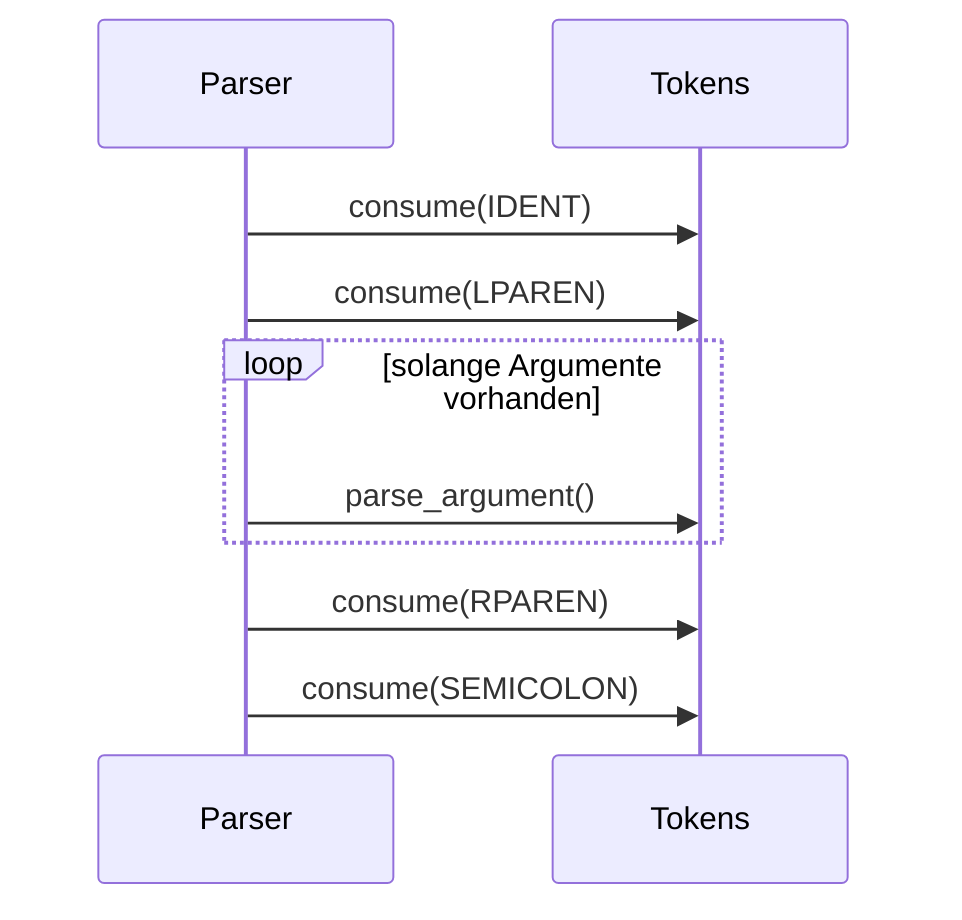

# Parser-Erklaerung fuer das aktuelle Template

Diese Datei erklaert den aktuellen Parser aus [parser.py](../parser.py) so, dass du den Ablauf direkt nachvollziehen kannst.

## Was der Parser aktuell macht

Der Parser nimmt Token vom Lexer und baut daraus einen einfachen AST auf.

Aktuell kann er nur:

- Funktionsaufrufe als Statements lesen
- Argumente in Funktionsaufrufen lesen
- am Anfang erzwingen, dass das erste Statement `log(...)` ist

Das ist bewusst ein Grundgeruest. Spaeter kannst du hier weitere Sprachelemente einbauen, zum Beispiel:

- `let`
- `if`
- `while`
- `fn`
- echte Ausdruecke mit Operatoren

## Die aktuelle Grammatik

```text
program        := statement* EOF
statement      := call_stmt
call_stmt      := IDENT LPAREN args? RPAREN SEMICOLON
args           := literal_or_ident (COMMA literal_or_ident)*
literal_or_ident := STRING | NUMBER | IDENT
```

## Gesamtuebersicht als Ablaufdiagramm

```mermaid
flowchart TD
    A[Token-Liste vom Lexer] --> B[Parser.__init__]
    B --> C[parse()]
    C --> D{EOF erreicht?}
    D -- nein --> E[parse_statement()]
    E --> F[parse_call_statement()]
    F --> G[parse_argument() fuer jedes Argument]
    G --> E
    D -- ja --> H[consume(EOF)]
    H --> I{Hat Programm Statements?}
    I -- nein --> J[SyntaxError: Leeres Programm]
    I -- ja --> K{Erstes Statement ist log(...)?}
    K -- nein --> L[SyntaxError: log muss am Anfang stehen]
    K -- ja --> M[Program-AST zurueckgeben]
```

## Der genaue Ablauf im Code

### 1) `parse()` ist der Einstieg

`parse()` ist die Hauptfunktion.

Sie macht genau diese Schritte:

1. Solange noch kein `EOF` erreicht ist, ruft sie `parse_statement()` auf.
2. Danach erwartet sie zwingend `EOF`.
3. Dann prueft sie, ob das Programm leer ist.
4. Danach prueft sie, ob das erste Statement `log(...)` ist.
5. Am Ende gibt sie einen `Program(...)`-Knoten zurueck.

## 2) `parse_statement()` ist aktuell nur ein Wrapper

Im Moment ist der Parser noch klein.

Darum macht `parse_statement()` einfach nur:

```text
parse_statement() -> parse_call_statement()
```

Das ist spaeter praktisch, weil du hier weitere Statement-Arten ergaenzen kannst.

Zum Beispiel:

- wenn Token `LET`, dann `parse_let_statement()`
- wenn Token `IF`, dann `parse_if_statement()`
- wenn Token `IDENT`, dann `parse_call_statement()`

## 3) `parse_call_statement()` liest einen Funktionsaufruf

Diese Funktion verarbeitet so etwas wie:

```text
log("Hallo", 123);
```

Sie liest die Tokens in dieser Reihenfolge:

1. `IDENT` -> Funktionsname
2. `LPAREN` -> oeffnende Klammer
3. optional Argumente
4. `RPAREN` -> schliessende Klammer
5. `SEMICOLON` -> Statement-Ende

### Bildlich



### Ergebnis im AST

Aus:

```text
log("Hallo", 123);
```

wird:

```text
CallStatement(
    function_name="log",
    args=[StringLiteral("Hallo"), NumberLiteral(123)]
)
```

## 4) `parse_argument()` liest einzelne Argumente

Aktuell kennt der Parser drei Argument-Typen:

- `STRING` -> `StringLiteral`
- `NUMBER` -> `NumberLiteral`
- `IDENT` -> `Identifier`

### Beispiel

```text
log("Wert:", x, 42);
```

Dann entstehen diese Argumente:

- `StringLiteral("Wert:")`
- `Identifier("x")`
- `NumberLiteral(42)`

## AST als Baum

Hier ein kleines Baumdiagramm fuer ein Beispiel:

```text
Program
└── CallStatement: log
    ├── StringLiteral: "Hallo"
    ├── Identifier: name
    └── NumberLiteral: 123
```

Oder als Mermaid-Baum:

```mermaid
graph TD
    A[Program] --> B[CallStatement: log]
    B --> C[StringLiteral: "Hallo"]
    B --> D[Identifier: name]
    B --> E[NumberLiteral: 123]
```

## Warum die Startregel wichtig ist

Der Parser erzwingt, dass das erste Statement `log(...)` ist.

Das hat zwei Vorteile:

1. Du hast direkt einen klaren Einstiegspunkt.
2. Das Projekt bleibt als Template einfach und kontrolliert.

Spater kannst du diese Regel wieder entfernen, wenn du eine vollstaendige Sprache baust.

## Was `current()` und `consume()` tun

### `current()`

- gibt immer das aktuelle Token zurueck
- veraendert den Parser-Zeiger nicht

### `consume(kind)`

- prueft, ob das aktuelle Token vom erwarteten Typ ist
- wenn ja, wird der Parser um eins weitergeschoben
- wenn nein, gibt es einen `SyntaxError`

Das ist der Kern des gesamten Parsers.

## Beispiel einer kompletten Eingabe

```text
log("Start");
log("Weiter", 123);
```

### Schritt fuer Schritt

1. `parse()` sieht das erste `log`
2. `parse_call_statement()` liest das erste Statement
3. `parse_argument()` liest `"Start"`
4. das erste Statement endet mit `;`
5. das zweite `log` wird genauso gelesen
6. am Ende kommt `EOF`
7. der Parser gibt ein `Program`-Objekt zurueck

## Wie du den Parser spaeter erweiterst

Der aktuell wichtigste Punkt ist: `parse_statement()` ist die Erweiterungsstelle.

Wenn du spaeter neue Sprachelemente willst, machst du dort neue Entscheidungen, zum Beispiel:

```text
if token.kind == "LET":
    return parse_let_statement()

if token.kind == "IF":
    return parse_if_statement()

return parse_call_statement()
```

## Merksatz

Der Parser ist nicht dafuer da, etwas auszufuehren.

Er baut nur eine Struktur aus Tokens, damit der naechste Schritt weiss, was das Programm bedeuten soll.

Das heisst:

- Lexer = Text in Token
- Parser = Token in Baum
- Runtime/Codegen = Baum ausfuehren oder uebersetzen

## Naechster sinnvoller Ausbau

Wenn du willst, kann ich als Nächstes noch eine zweite Doku-Datei machen:

- nur fuer den Lexer
- oder nur fuer den AST
- oder eine komplette Uebersicht mit allen Dateien und Pfeildiagramm
